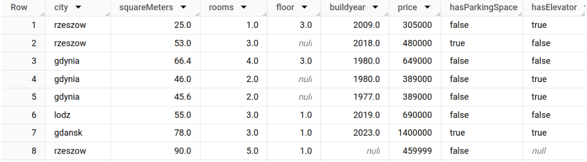
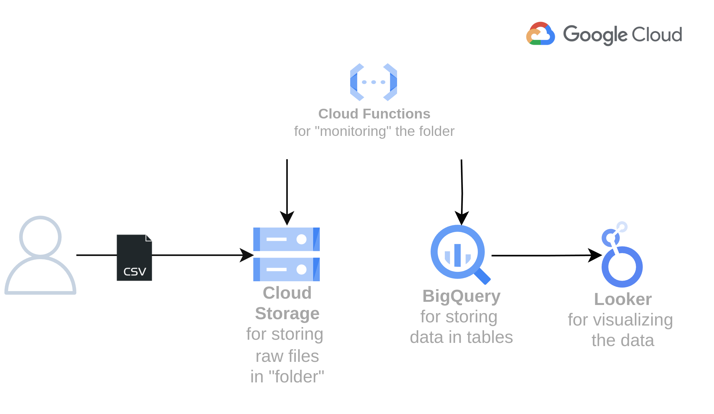
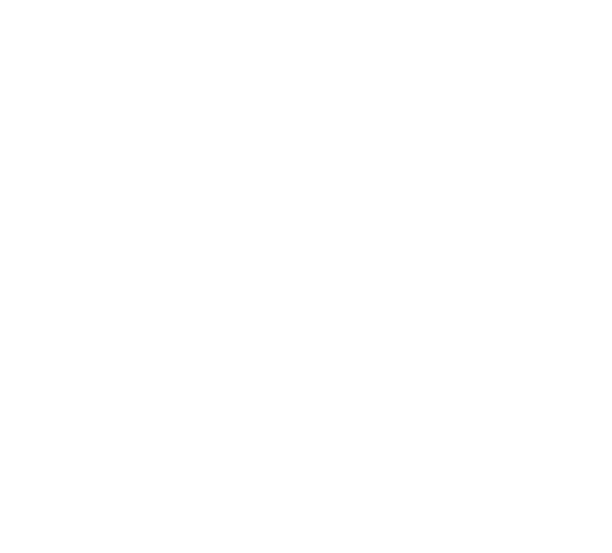
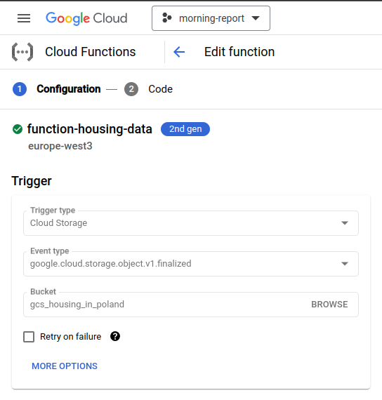

## 1. Project Overview
- **Project Name:** Analyze Apartment Sales in Poland
- **Scenario:** Sales Department from a company called “(Not So) Real Estate Poland” gathers info about the apartments for sales in Poland.
- **Problem Statement:** They want a tool to:
  - “dump” their CSV files in, 
  - and be able to analyze them later. (in SQL, or some reporting tool like PowerBI)

## 2. About

### Data sources
[Apartment Prices in Poland](https://www.kaggle.com/datasets/krzysztofjamroz/apartment-prices-in-poland) dataset by Krzysztof Jamroz. It's a monthly-updated dataset that looks something like: \

### Data Transformations
1. I extracted the data in the original data type. I kept all the information.
2. I loaded all data from files into a BigQuery table *apartment_sales*.
3. Then, I created custom views.

### Target Systems
BigQuery database

## 3. Architecture

### High-level Architecture

Within the bucket, I also decided to implement some logic to archive those files which are already processed. Here's the simple logic:

### Technologies Used

| Technology        | Used For:                                                                                          |
|-------------------|----------------------------------------------------------------------------------------------------|
| Cloud Storage     | Storing & archiving files                                                                          |
| Cloud Functions   | 1. Monitoring files coming to GCS bucket, 2. Loading data to BigQuery, 3. Archiving processed data |
| BigQuery          | Data warehouse                                                                                     |
| (optional) Looker | Visualizing data. You might visualize using simple views in BigQuery also.                         |

## 4. Step-by-Step Guide

### Prerequisites:
- No local setup required
- Google Cloud Platform:
  - free trial account is sufficient
  - User with owner role
  - Enabled APIs: Storage API & BigQuery API

### Configuration:

#### 1. GCS Bucket:
   1. Create bucket *gcs_housing_in_poland* (for raw & processed files)

#### 2. Cloud Functions:
   1. Create *function_apartment_sales*. Set cloud storage as trigger: \
    
   2. Set code environment to Python 3.10
   3. Replace function.py and requirements.txt with [cloud_function](cloud_function/). Change variables marked as #TODO
   4. Save & deploy

#### 3. BigQuery:
   1. Create dataset *apartment_sales*
   2. Create main table *apartment_sales* & views (see [bigqueryschema.sql](bigqueryschema.sql) file)

### Execution:

1. Download and unzip [Apartment Prices in Poland](https://www.kaggle.com/datasets/krzysztofjamroz/apartment-prices-in-poland) dataset by Krzysztof Jamroz
2. Load files into your GCS bucket
3. Refresh BigQuery table to verify data was loaded.
4. (if any errors, refer to *"logs"* section of your *Cloud Function*)

### Post Scriptum
I also made a .ppt presentation on this project, feel free to take a look!